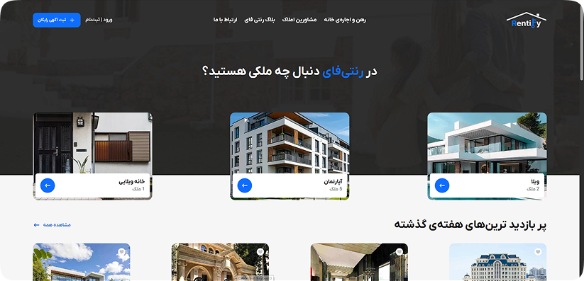

  

<h3 align="center">Rentify</h3>

  <a href="https://rentify-rose.vercel.app" style="margin: 0 10px;">View Demo</a>

## 📸 Preview

## 🚀 Features

- Advanced admin panel for managing listings, users, and bookings
- Performance optimization and high loading speed
- Advanced search capabilities with multiple filters (location, price, type, etc.)
- User panel with authentication and authorization (sign up, login, roles)
- Interactive maps with property markers using Leaflet
- Responsive design for mobile and desktop devices
- Smooth animations and transitions with Framer Motion
- Image gallery for each property using Swiper
- Integration with MongoDB for secure and scalable data storage
- SEO-friendly structure with SSR and SSG in Next.js
- Simple and attractive user interface using Shadcn UI components
- ...more

## 🛠️ Tech Stack

| Tech          | Description                             |
| ------------- | --------------------------------------- |
| Next.js       | Fullstack React framework for SSR & SSG |
| TypeScript    | Programming language |
| MongoDB       | NoSQL database                          |
| Tailwind CSS  | Utility-first CSS framework             |
| Shadcn UI     | UI component library                    |
| Framer Motion | Animation library for React             |
| Swiper        | JavaScript library for sliders          |
| Leaflet       | Interactive maps library                |
| Iconsax       | Icon font scripts                       |